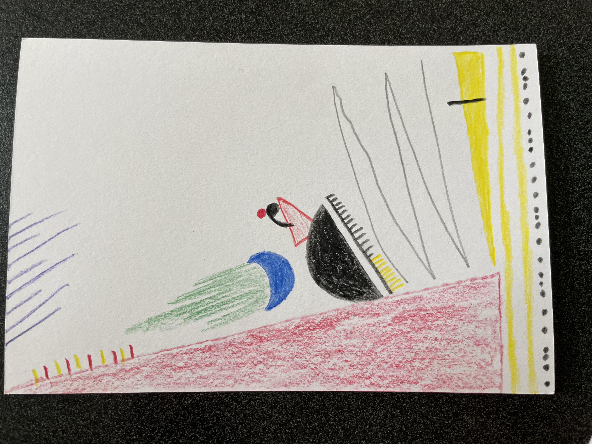

# Drew Keller

I'm a second-year MS Computational Analysis and Public Policy (CAPP) student. I'm interested in data science applied in government and policy research. While my strongest interests relate to modeling and experimental design, I also want to improve my data presentation skills on the front end. I am generally a very visual/spatial thinker (I especially love maps) so I am excited for this class! 